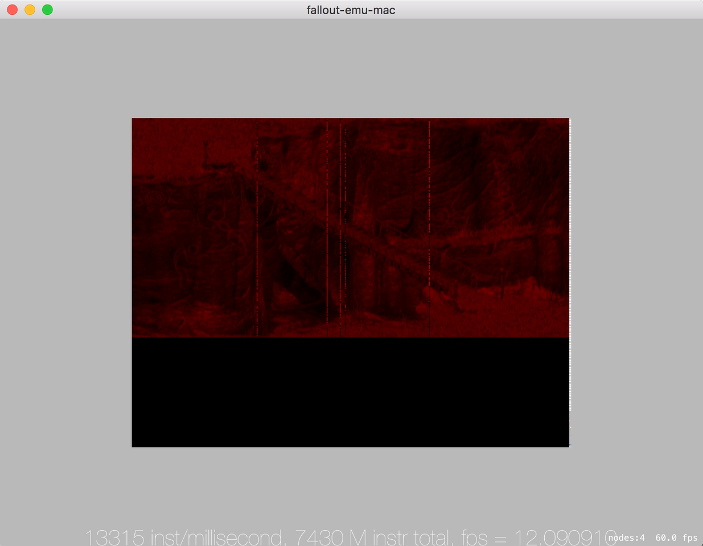
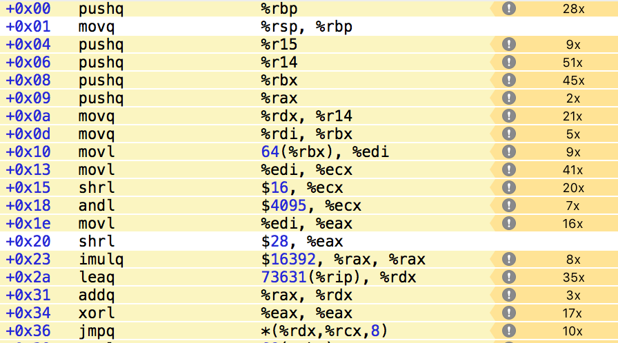
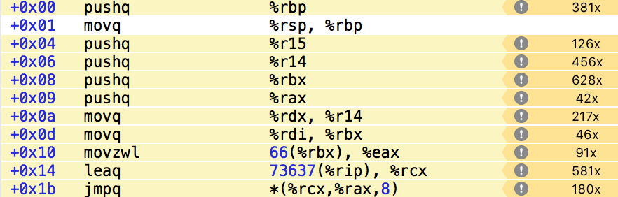

layout: post
title: "Fallout Emu"
date: 2015-12-17 00:00:00 -0000
categories: development

# Fallout Emu
Fallout Emu это эмулятор x86 процессора с расширением в виде реализации части Win32 API, для того, чтобы сделать возможным запуск на нем игры Fallout 2. На данной странице будет освещаться обновление статуса проекта.

Alexander Smirnov, alexander@smirn0v.ru

## 22 DECEMBER 2015 18:59

Добился стабильных 10-12 FPS на вступительном ролике. Вот видео https://youtu.be/DXt2ODQZ114 Как и описывал – основная проблема была в том, что когда начинает проигрываться ролик Fallout вызывает функцию VirtualProtect и помечает часть секции исполняемого кода, как доступную на запись и на лету как-то модифицирует код, который участвует в отрисовке. Это отключало мое кеширование уже задисассемблированных инструкций.

Сначала пробовал в лоб, без изменения к подходу раздачи прав на виртуальную память. Ловил моменты, когда идет запись в виртуальный блок памяти и помечал его как не кешируемый при дизассемблировании, но не перманентно, а на ближайших 100 инструкций. После 100 он опять начинает кешироваться. Если во время этих 100 инструкций будет произведена опять запись в эту область памяти, то кеширование отложится еще на 100 инструкций. Причем сбрасывал я весь кеш дизасма каждый раз. Это не очень хорошо работало, т.к. кеш сбрасывался часто и слишком много. Плюс где-то была еще проблема т.к. после N сбрасываний фетчилась не верная инструкция. Пока не выяснил почему, переключился на другой вариант.

Зашел с немного другой стороны. Вместо того, чтобы выставлять access rights на целый блок памяти, который был выделен или замаплен – сделал выставление прав возможным на каждый блок по 4KB. Теперь не обязательно выставлять write flag на всю секцию исполняемого кода, а только на ту, что запросили. Поправил дизассемблирование и кеширование в соответствии с этим и получил 10-12 FPS на проигрывании ролика уже сейчас. Но всеравно во время проигрывания ролика часто участвует тот кусок кода, который модифицировался и там не работает кеш и это дает тормоза. Следующим шагом нужно это будет добить.

Так выглядит последнее изображение, которое выдает эмулятор. Дальше похоже начинает сказываться то, как криво сделан ddraw, вероятно уже должно отрисовываться меню игры, но из-за особенностей ddraw его нет на экране. Этим будем заниматься сильно позже.

## 20 DECEMBER 2015 19:20

Остальные попытки оптимизаций из разряда замены подобного кода

    FERegisterName beu_register32_from_argtype(Int32 argtype, Int32 argposition) {
        assert(argposition == 0);
    
        if(argtype & REG0) return kEAX;
        if(argtype & REG1) return kECX;
        if(argtype & REG2) return kEDX;
        if(argtype & REG3) return kEBX;
        if(argtype & REG4) return kESP;
        if(argtype & REG5) return kEBP;
        if(argtype & REG6) return kESI;
        if(argtype & REG7) return kEDI;
        
        assert(false);
        exit(-1);
    }
На обращение через массив ничего не дает. Но результаты есть.
### Lowercase
Ранее все названия подключаемых dll явно везде lowercase'ил, без разбора. Обнаружил, что когда уже идет rendering loop, то часто используемые функции из dll, такие как **GetTickCount** тормозят, потому что при вызове делается lowercase. Немного пересмотрел код оставив lowercase только в самом начале, а при обращениях сам уже правильно указываю название.
### Rep/Repne
Rep/repne это префиксы перед некоторыми инструкциями, которые говорят процессору – повторяй эту инструкцию, пока **ecx** не будет равен 0 или не будет выставлен или сброшен флаг **ZF**.

Ранее реализовал это проверяя префикс перед выполнением каждой инструкции процессора. Но rep/repne могут быть выставлены только ряду инструкций. Утащил обработку внутрь.
### DISASM results
Сейчас эмулятор после того как дизассемблировал очередную инструкцию – запоминает результат и в следующий раз при выполнении этого же места использует предыдущий результат. В какой-то момент это дало просто отличные результаты и операцию дизассемблирования ушла вниз в профайлере.

Но такой трюк можно выполнять, только если выполняемая страница памяти помечена как READONLY|EXEC. Если же память разрешена на запись – такого делать нельзя, т.к. программа модифицирует сама себя, меняется на ходу.

Кто бы мог подумать, что Fallout 2 этим занимается ? Прямо перед тем как начинается rendering loop происходит вызов **VirtualProtect** и блок **BEGTEXT** разрешается на запись. Т.е. прямо перед rendering loop скорость знатно падает. Попробовал в качестве эксперимента отключить проверку. FPS с 2 возрос до 12, но на картинке появились странные артифакты. Конечно так делать нельзя.

На данный момент в эмуляторе access rights раздаются не на страницы памяти, а на виртуальные блоки. Поэтому весь **BEGTEXT** помечается на запись. Возможно запрашивается такой доступ не на весь и нужно несколько изменить архитектуру, чтобы не проигрывать по скорости.

## 20 DECEMBER 2015 03:58
Branch'инг зло. Нужно избегать условий, так будет работать быстрее. Но не всегда все так просто. Думал, что смогу улучшить следующий блок кода:

    uint32_t beu_load_arg_value(ARGTYPE * arg, uint32_t immediat, FEProcessContext *process) {
        FEBitWidth bitWidth = (FEBitWidth)arg->ArgSize;
        
        if(arg->ArgType & REGISTER_TYPE) {
            if(arg->ArgType & GENERAL_REG) {
                FERegisterName regName = beu_register_from_argtype(arg->ArgType, arg->ArgPosition,  bitWidth);
                return fe_threadContext_register(process->currentThread, regName, bitWidth);
            } else if (arg->ArgType & SEGMENT_REG) {
                FERegisterName regName = beu_seg_register_from_argtype(arg->ArgType);
                return fe_threadContext_register(process->currentThread, regName, bitWidth);
            } else {
                assert(false);
            }
        } else if(arg->ArgType & MEMORY_TYPE) {
            return beu_load(arg, process, bitWidth);
        } else if(arg->ArgType & CONSTANT_TYPE) {
            return (uint32_t)beu_sign_extend(immediat, bitWidth);
        }
        
        assert(false);
        return 0;
    }
if/if/else if и т.п. Можно попробовать от этого избавиться сделав безусловные переходы на основе констант. Получилось, используя пару трюков.
    
    uint32_t beu_load_arg_value(ARGTYPE * arg, uint32_t immediat, FEProcessContext *process) {
        static const void* flow[9][2049] = {
            {},
            {},
            { // REGISTER_TYPE
                [0 ... 1] = (void*)0,
                &&GENERAL_REGISTER_FLOW, // GENERAL_REG
                [3 ... 255] = (void*)0,
                &&SEGMENT_REGISTER_FLOW,  // SEGMENT_REG
                [257 ... 2048] = (void*)0
            },
            {}, //3
            {[0 ... 2048] = &&MEMORY_TYPE_FLOW}, // MEMORY_TYPE
            {}, //5
            {}, //6
            {}, //7
            {[0 ... 2048] = &&CONSTANT_TYPE_FLOW}, //CONSTANT_TYPE
        };
    
        goto *flow[(arg->ArgType >> 28)&0xf][(arg->ArgType>>16)&0xfff];
    
        GENERAL_REGISTER_FLOW: {
            FERegisterName regName = beu_register_from_argtype(arg->ArgType, arg->ArgPosition,  (FEBitWidth)arg->ArgSize);
            return fe_threadContext_register(process->currentThread, regName, (FEBitWidth)arg->ArgSize);
        };
    
        SEGMENT_REGISTER_FLOW: {
            FERegisterName regName = beu_seg_register_from_argtype(arg->ArgType);
            return fe_threadContext_register(process->currentThread, regName, (FEBitWidth)arg->ArgSize);
        };
        
        MEMORY_TYPE_FLOW: {
            return beu_load(arg, process, (FEBitWidth)arg->ArgSize);
        };
    
        CONSTANT_TYPE_FLOW: {
            return (uint32_t)beu_sign_extend(immediat, (FEBitWidth)arg->ArgSize);
        };
    
        assert(false);
        return 0;
    }
    
Новое для меня тут было использование адресов goto меток.
http://blog.llvm.org/2010/01/address-of-label-and-indirect-branches.html
https://gcc.gnu.org/onlinedocs/gcc/Labels-as-Values.html#Labels-as-Values

Это должно давать отличный прирост, ведь мы уходим от условных переходов совсем.

Второе, это designated array initializer для массивов. Строки вида **[0 ... 2048] = some**
https://gcc.gnu.org/onlinedocs/gcc/Designated-Inits.html

Проблема лишь в том, что вместо нескольких условных переходов, часть из которых и не выполняется новый код содержит несколько побитовых сдвигов, побитовое "и" и еще умножение ([i][j] же превращается в i * sizeof(type) * 2049+j * sizeof(type)).

Сдвиг на на 16 бит и побитовое "и" с 0xfff

    shrl $16, %ecx
    andl $4095
Сдвиг на 28 бит. Побитовое "и" ушло с оптимизацией, т.к. использовался 32 битный регистр %eax и после сдвига остается 4 бита, нет смысла делать "и".

    shrl $28, %eax
Умножаем результат сдвига на 28 на 16392, что есть 2049 умноженное на размер указателя void*. 2049 * 8 = 16392. У меня 64 bit система, поэтому 8 байт на указатель.

    imulq $16392, %rax, %rax
Массив **flow** находится по какому-то смещению относительно текущего места исполнения. Используя relative addressing добавляем к базовому результату уже лежащему в **%rax**

    leaq 73631(%rip), %rdx
    addq %rax, %rdx
Теперь долгожданный **безусловный** переход. Синтаксис * (base, index, scale) обозначает взять значение по адресу base + index*scale. Т.е. именно тут мы наконец домножили на 8, т.е. на размер указателя на void на 64bit системе.

    jmpq *(%rdx,%rcx,8)
    
Все это проигрывает простому предыдущему варианту начала

Кажется, что на первый взгляд проблема в большом количестве арифметики. Это просто решается.

    static const void* flow[65535] = {
            [0 ... 8193] = &&FAIL_FLOW,
            &&GENERAL_REGISTER_FLOW, // REGISTER_TYPE | GENERAL_REG
            [8195 ... 8447] = &&FAIL_FLOW,
            &&SEGMENT_REGISTER_FLOW,
            [8449 ... 16383] = &&FAIL_FLOW,
            &&MEMORY_TYPE_FLOW,
            [16385 ... 32767] = &&FAIL_FLOW,
            &&CONSTANT_TYPE_FLOW, // CONSTANT_TYPE
            [32769 ... 33791] = &&FAIL_FLOW,
            &&CONSTANT_TYPE_FLOW, // CONSTANT_TYPE | RELATIVE_
            [33793 ... 34815] = &&FAIL_FLOW,
            &&CONSTANT_TYPE_FLOW, // CONSTANT_TYPE | ABSOLUTE_
            [34817 ... 65534] = &&FAIL_FLOW
        };

        goto *flow[*((uint16_t*)(&arg->ArgType)+1)];
Массив теперь одномерный, а для того, чтобы не нужно было делать никаких смещений  можно обратиться сразу к нужному слову из ArgType. Это дает такой итог

Действительно индекс из **ArgType** достается одной командой

    movzwl 66(%rbx), %eax
66 байт смещение от **%rbx** из-за структуры **ARGTYPE**

    #pragma pack(1)
    typedef struct  {
       char ArgMnemonic[64];
       Int32 ArgType;
       Int32 ArgSize;
       Int32 ArgPosition;
       UInt32 AccessMode;
       MEMORYTYPE Memory;
       UInt32 SegmentReg;
    } ARGTYPE;
    #pragma pack()
    
Т.е. пропускается 64 байта от **ArgMnemonic** и потом еще 2 байта от **ArgType** т.о. получая второе слово из **ArgType**. Тут интересный момент. Инструкция **movzwl** здесь работает только с **%eax**, но на самом деле на x86_64 **mov**, который работает с 32bit регистрами автоматически обнуляет верхнюю часть соответствующего 64bit регистра. Именно за счет этого **jmpq** ниже, использующий  **%rax** работает корректно.

Что же в итоге ?..

Последний вариант при повторных замерах все-равно проигрывает оригинальному с if/else/else if где-то на 1K инструкций в миллисекунду. На самом деле результат еще мажется тем, что вот эта вот часть с бранчингом она и не была узким местом функции. Узкое место в дальнейших вызовах, возможно после их оптимизации можно будет вернуться к этому вопросу, а пока сложно сделать вывод "почему", когда слишком много еще всего в функции, что вероятно по другому оптимизируется компилятором в зависимости от начала функции.

Но было интересно, да.

    

## 17 DECEMBER 2015 23:52
Решил начать вести записи по проекту. Сейчас первый кадр выглядит так 
В красных тонах потому что мне сильно не до детальных разбирательств с DirectDraw которому уже лет 15 и пока лень разбираться с палитрой.
С помощью SpriteKit довольно быстро получилось сделать простейшее приложение, которое закидывает в текстуру данные полученные от эмулятора и выводит кадры игры.

Можно посмотреть видео: [первые кадры](https://www.dropbox.com/s/grwi5uoidkfy4lu/fallout-emu-17-dec-2015.mov?dl=0)

Видно:

* Картинка появляется где-то на 1.6 миллиардной инструкции процессора
* Скорость где-то 18-19 тыс. инструкций в миллисекунду, позже падает
* FPS от 2 до 10. Но 10 только, когда кадр почти пустой

Сейчас основная проблема это скорость. 2 FPS это конечно не интересно. Последние изменения, которые делал для скорости следующие:

* Изменил реализацию виртуальной памяти. Теперь все адресное пространство процесса бьется на блоки по 4KB, аллокация происходит только на начало таких блоков. Есть shadow массив, где каждый элемент соответствует 1 блоку в 4KB. Элемент массива это указатель на полный аллоцированный блок, который представлен структурой FEMemoryMapBlock. Т.е. теперь при обращении к какому-то адресу виртуальной памяти можно просто разделить его на 4KB и получить индекс в shadow массиве, взять real address из FEMemoryMapBlock и прибавить к нему оставшееся смещение. Т.е. в операции нет никаких сравнений, поисков и т.п. Это дало выйгрыш где-то на 1.5-2K инструкций в миллисекунду по сравнению с прошлой реализацией где блок в 4KB мог содержать несколько реальных блоков.
* В функциях записи, чтения регистров по имени сделал массив с указателями на все регистры, так, что по enum имени регистра можно в массиве получить сразу указатель на регистр. Т.е. избавился от switch. Выигрыш дало, но не существенный. Оно изначально не сильно в топе было, сейчас просто вообще не видно этого в профайлере.

Баги с которыми столкнулся в последнее время:

* Раньше в реализации мапинга виртуальной памяти на реальную одному блоку в 4KB могло присваиваться несколько лишних блоков реальной памяти. Это било только по скорости, т.к. раньше еще и проверки были на то действительно ли блок содержит искомый адрес. Теперь проверок вообще нет. Вероятно надо будет сделать в спец. режиме – включенные проверки, т.к. сейчас получается, что если будет проблема в этой области, то упадет хостовое приложение запустившее эмулятор.
* Флаг процессора **OF** не обновлялся по итогам многих инструкций, т.к. почему-то упустил его выставление из слова. Странно, что это так редко стреляло.
* Периодически падал эмулятор где-то на инструкции **SCASB**. Эта инструкция используется для того, чтобы найти байт с определенным значением в строк. Используется с префиксом повторения rep/repne. Например для поиска конца строки. **SCASB** движется влево или вправо по строке в зависимости от значения флага **DF** процессора. В ходе отладки увидел, что **DF** был выставлен в 1, что приводило к движению "влево". А искался символ конца строки... Пытаясь понять, кто же все-таки поменял **DF** на 1 увидел, что никто. Проблема была лишь в том, что после выделения памяти под флаги процессора, я просто не инициализировал эту память и периодически **DF** получал случайно значение 1, которое в последствии ни одна инструкция не меняла. Вообще не много инструкций **DF** затрагивают. Очевидная ошибка.
